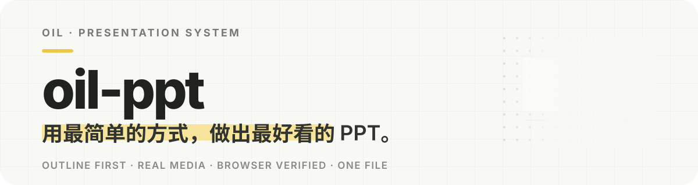
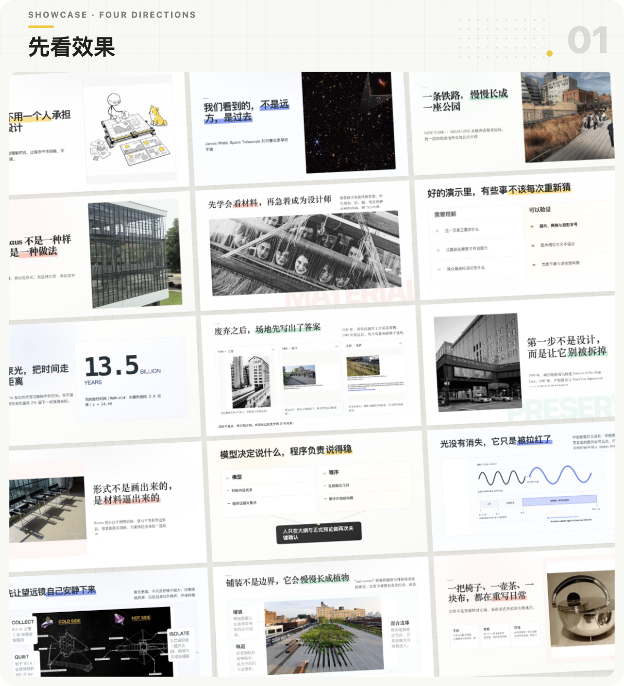
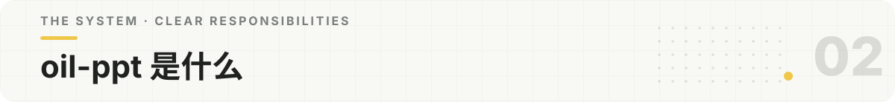

<p align="center">
  
</p>

<p align="center">
  
</p>

<p align="center">
  
</p>

oil-ppt 是一个给 Agent 使用的 PPT Skill。我们可以给它一个主题、一份文档或一组材料，它会先确认这套演示要讲什么，再生成可以全屏播放、离线打开的 16:9 HTML 演示文稿。

上面的十五张页面来自四套真实演示，分别使用黄色、钴蓝、苔绿和陶土色。它们共享同一套设计系统，但素材、密度和页面结构会跟着内容改变。

它不让模型同时承担内容、排版、图片适配和浏览器检查。模型负责理解与选择，oil-ppt 负责稳定执行，我们负责两次关键确认。最后只交付一个 `演示文稿.html`。

| 模型负责 | oil-ppt 负责 | 我们负责 |
| --- | --- | --- |
| 理解受众、组织内容、判断页面关系、选择素材 | 网格、字号、间距、组件、图片适配、溢出与浏览器检查 | 确认 Markdown 大纲和正式预览 |

<p align="center">
  
</p>

DeepSeek、混元 HY 等性价比模型已经能理解材料和整理结构。真正容易让它们失手的，是要求它们在同一时间记住几十条设计规则，还要把每个尺寸都执行正确。

oil-ppt 把大任务拆成四个有限选择：

1. 先用 Markdown 确认讲什么。
2. 再判断每页是焦点、对比、流程、证据还是图文关系。
3. 由经过验证的组件完成具体排版。
4. 用程序检查文字、素材、页面节奏和浏览器结果。

这不是说性价比模型在所有能力上等同于 Claude 或 GPT，而是让它在「制作 PPT」这件事上，不必凭空成为全能设计师，也能沿着清楚的路径做出比肩更强模型的成品。

<p align="center">
  
</p>

```text
主题或材料
  → Markdown 大纲
  → 我们确认内容
  → 页面结构与素材计划
  → 正式预览
  → 我们确认视觉
  → 演示文稿.html
```

大纲没有确认之前不会提前设计，正式预览没有确认之前不会构建最终文件。

<p align="center">
  
</p>

**方式一 · 执行命令**

```bash
npx skills add oil-oil/oil-ppt
```

**方式二 · 直接交给 Agent**

把下面这句话发给 Agent，让它完成安装：

```text
请安装这个 Skill：https://github.com/oil-oil/oil-ppt
```

安装完成后，调用名是 `oil-ppt`：

```text
[$oil-ppt] 帮我做一份关于这个主题的演示文稿。
```

新建演示时，我们可以选择通过对话一起整理大纲，或根据已有材料直接生成第一版。

适合产品介绍、设计方案、案例展示、教程、研究结论和项目汇报。它更适合有明确观点、需要现场讲述的内容，不会把长文机械切成几十张信息密集的页面。

<details>
<summary><strong>维护与本地检查</strong></summary>

```bash
oil-ppt/scripts/oil-ppt doctor
```

</details>

<p align="center">
  <a href="https://github.com/oil-oil/beautify-github-readme"></a>
</p>

<p align="center"><sub>MIT License</sub></p>
