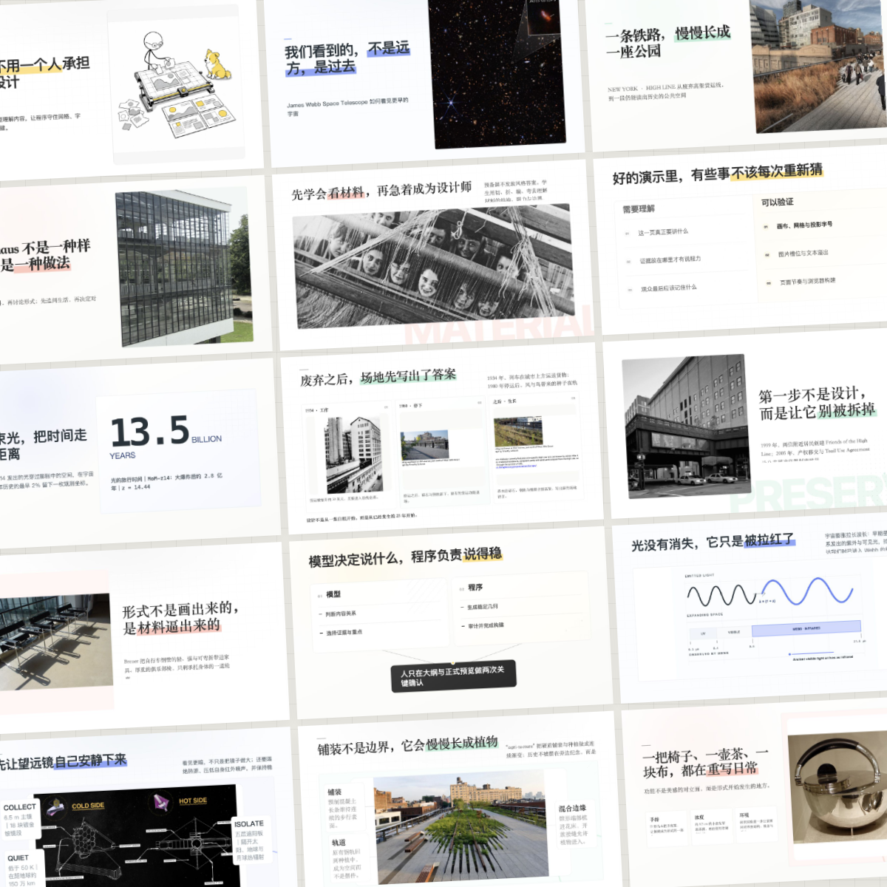
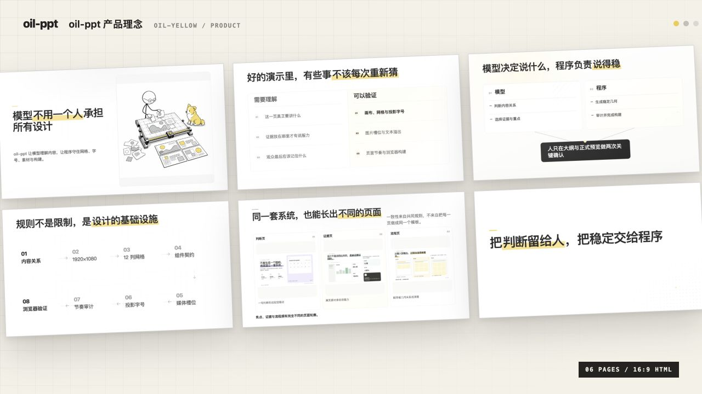
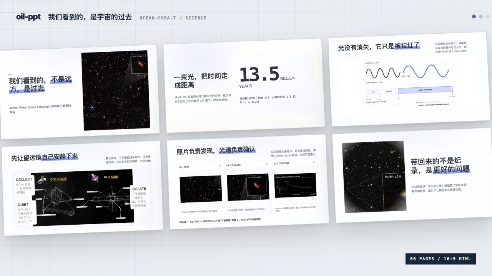
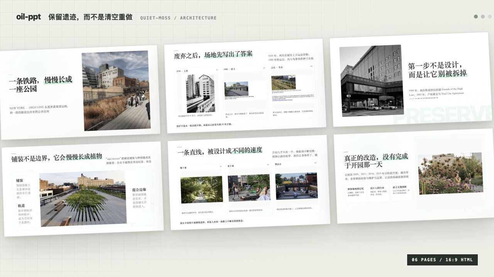
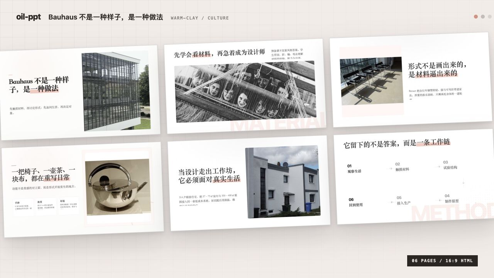

<p align="center">
  
</p>

<p align="center">
  <strong>oil-ppt</strong><br>
  用最简单的方式，做出最好看的 PPT。
</p>

<p align="center">
  16:9 HTML 演示文稿 · 真实素材 · 自动排版 · 浏览器检查 · 单文件交付
</p>

```bash
npx skills add oil-oil/oil-ppt
```

oil-ppt 是一个给 Agent 使用的 PPT Skill，帮助大家用最简单的方式，做出最好看的 PPT。

我们可以给它一个主题、一份文档或一组现有材料。它会先和我们确认这套演示要讲什么，再生成可以全屏播放、离线打开的 16:9 HTML 演示文稿。这里的简单，不是跳过内容和设计，而是让大家不用处理网格、字号、图片比例和浏览器检查。

它和直接让模型写一套 PPT 最大的不同，是中间多了一套清楚的制作流程，以及自动排版和检查。我们不需要会写程序，也不需要操作这些检查，它们会在 Skill 内部自动完成。

## 它解决什么问题

如果只让模型自己做 PPT，模型需要同时完成两件很不一样的事：

1. 理解材料，判断每一页应该讲什么。
2. 处理网格、字号、间距、图片比例、页面变化和浏览器构建。

第一件事需要理解内容，适合交给模型。第二件事有很多固定规则，而且只要漏掉一项，页面就可能出现很小的字、被裁错的图片、装不下的正文，或者连续几页都长得一样。

DeepSeek V3 这类性价比模型，通常已经能理解内容、整理结构，也能做出不错的页面判断。真正容易让它失手的，是要求它在同一时间记住几十条设计规则，还要把每个尺寸和细节都执行正确。更强的模型可以做得更稳，但也没有必要每次重新计算同一套网格和尺寸。

所以 oil-ppt 把工作拆开了：

| 谁负责 | 具体做什么 |
| --- | --- |
| 模型 | 理解主题和受众，整理讲述顺序，判断一页要说什么，选择真正有用的素材 |
| oil-ppt 内部程序 | 生成稳定的页面结构，控制字号和间距，适配图片，检查溢出和整套节奏 |
| 我们 | 确认大纲是否讲对了，确认正式预览是否可以交付 |

最后得到的是一个 `演示文稿.html`。双击可以打开，全屏可以播放，不需要额外安装字体、网页服务或演示软件。

## 这里说的「程序」是什么

这里的程序，就是随 Skill 一起安装的一组排版规则和检查脚本。它不是让大家写代码，而是在模型生成内容之后，自动把容易出错的工作接过去。

它会负责：

- 把每一页固定在 1920×1080 的 16:9 画布上
- 使用统一的 12 列网格、安全区、字号和间距
- 根据内容关系选择焦点、对比、流程、照片、证据板等页面结构
- 检查图片文件、比例、裁切方式和外框是否正确
- 检查标题和正文有没有超出容器，字号是否适合投影
- 检查连续页面是不是反复使用同一种轮廓
- 最后在浏览器里验证页面能否正常加载和播放

这些事情都有明确答案，也可以被检查，所以不需要模型每次重新猜。

## 为什么性价比模型也能做出好 PPT

我们的目标，不是说 DeepSeek V3 这类模型在所有能力上都等同于 Claude 或 GPT，而是让它在「制作 PPT」这项具体任务里，也能做出比肩更强模型的成品。

这是因为 oil-ppt 没有让模型从一张空白画布开始，独自完成所有工作。它把一个很难的大问题，拆成一连串更简单、更明确的小判断：

1. **先判断讲什么。** 模型只需要理解材料、整理顺序，先生成 Markdown 大纲，不必一边想内容一边排版。
2. **再判断内容关系。** 这一页是强调一个结论、比较两个对象、解释一段流程，还是展示一张真实图片？模型只需要选择关系，不需要现场发明版式。
3. **让组件完成排版。** 每种关系都有经过验证的页面组件，网格、字号、间距、图片比例和装饰方式已经写在里面。
4. **让检查发现错误。** 如果出现文字溢出、字号太小、图片失真、轮廓重复或页面无法加载，浏览器检查会把问题明确指出来。
5. **让我们确认关键判断。** 大纲和正式预览各确认一次，模型不需要在错误方向上连续生成十几页。

模型仍然负责它擅长的理解、选择和表达；oil-ppt 负责那些有标准答案、可以重复执行的工作。这样一来，模型不需要非常聪明地记住所有细节，只需要在每一步做对一个有限的选择。

这也是性价比模型能够被充分引导的原因：**我们不是要求它凭空成为一名全能设计师，而是给它一条足够清楚的路，让它把已有能力稳定地发挥出来。**

## 为什么制作时要一页一个 HTML

oil-ppt 在制作阶段不会让模型直接修改一个包含整套演示的大 HTML，而是让每一页拥有独立的 HTML 文件。这样做不是为了把项目变复杂，而是为了把每次修改的范围缩小到一页。

如果十几页都写在同一个文件里，模型修改第 7 页时，仍然要同时读懂前后所有页面、公共样式、脚本和元素编号。文件越长，互相影响的地方越多。性价比模型很容易在修改一处内容时，顺手改坏另一页的样式、重复一个 ID、漏掉一个闭合标签，甚至让整套演示无法打开。

拆成一页一个 HTML 之后：

- 模型每次只需要理解当前这一页，输入更短，需要记住的事情更少
- 当前页面的内容和样式被隔离，改坏一页不会直接伤到其他页面
- 每一页都可以单独检查文字溢出、图片加载和组件结构
- 出现问题时，我们能准确知道是哪一页，不需要在一个大文件里寻找
- 公共网格、交互和播放逻辑由 runtime 统一提供，不需要模型重复修改

所以，制作时使用多个小文件，是为了让能力不那么强的模型也能安全地逐页完成；交付时，oil-ppt 会再把页面、样式、脚本和素材自动合并进一个 `演示文稿.html`。**内部容易修改，最后仍然只有一个文件。**

## 如果没有这层程序

直接生成 PPT 当然也可能得到好页面，但结果会更依赖模型当时有没有同时记住所有设计细节。

常见的问题不是某一页完全不能看，而是质量慢慢漂掉：这一页标题太小，下一页图片多套了一层边框，再下一页又变成三张卡片；单独看都像完成了，放在一起却不像同一套演示。

oil-ppt 不会替模型把内容想对，也不能保证任何主题自动变好看。它做的是更具体的事：把已经确定的设计规则反复执行，并且在交付之前检查结果。

## 它能做出什么

开头的十五张页面来自四套真实演示。它们使用同一套排版和检查规则，但主题、配色、素材与页面轮廓并不相同。

<table>
  <tr>
    <td width="50%"></td>
    <td width="50%"></td>
  </tr>
  <tr>
    <td align="center"><sub>oil-ppt 产品理念 · 黄色</sub></td>
    <td align="center"><sub>詹姆斯·韦布空间望远镜 · 钴蓝</sub></td>
  </tr>
  <tr>
    <td width="50%"></td>
    <td width="50%"></td>
  </tr>
  <tr>
    <td align="center"><sub>纽约高线公园 · 苔绿</sub></td>
    <td align="center"><sub>包豪斯设计方法 · 陶土色</sub></td>
  </tr>
</table>

同一套规则不等于每一页长得一样。内容是一个结论、两个对象的对比、一段流程，还是一张需要仔细看的真实照片，会得到不同的页面结构。

## 它和常见的 PPT Skill 有什么不同

不同 PPT Skill 的做法并不完全一样。下面对比的是最常见的「让模型直接生成整套页面」方式。

| | 常见的直接生成方式 | oil-ppt |
| --- | --- | --- |
| 开始制作 | 收到主题后直接生成页面 | 先生成一份 Markdown 大纲，确认内容再设计 |
| 页面排版 | 模型每次临时写布局和样式 | 模型选择内容关系，程序生成经过验证的页面结构 |
| 图片处理 | 由模型判断尺寸和裁切 | 先生成素材计划，再检查文件、比例、保真和裁切 |
| 字号与溢出 | 主要依靠模型和肉眼检查 | 有文本预算、字号下限和浏览器溢出检查 |
| 整套节奏 | 依靠模型记住前面做过什么 | 检查页面轮廓、密度、背景和视觉重心是否重复 |
| 人工确认 | 通常在生成完成之后查看 | 大纲和正式预览各确认一次 |
| 最终交付 | 取决于每次生成的项目结构 | 固定交付一个可离线播放的 HTML 文件 |

oil-ppt 的区别不只是多了一些模板，而是把设计质量变成了可以重复执行、可以检查的过程。我们不需要只凭一句「看起来更好」判断它有没有完成。

## 怎么完成一套演示

```text
给出主题或材料
  → 生成 outline.md
  → 我们确认讲述内容
  → oil-ppt 选择页面结构并准备素材
  → 生成正式预览
  → 我们确认视觉结果
  → 构建 演示文稿.html
```

大纲没有确认之前，不会提前制作页面。正式预览没有确认之前，也不会构建最终文件。这样可以把内容问题留在内容阶段解决，把视觉问题留在预览阶段解决。

## 怎么使用

安装：

```bash
npx skills add oil-oil/oil-ppt
```

仓库与产品名是 `oil-ppt`，当前 Skill 调用名仍然是 `oil-slides`：

```text
[$oil-slides] 帮我做一份关于这个主题的演示文稿。
```

新建演示的时候，oil-ppt 会先问我们：是通过对话一起整理大纲，还是根据现有材料直接生成第一版大纲。

之后按照提示确认就可以了，不需要自己调用内部脚本，也不需要手动选择网格、字号和图片容器。

## 适合什么内容

- 产品介绍、发布和功能讲解
- 设计方案、案例和作品展示
- 教程、方法论和知识分享
- 项目复盘、研究结论和内部汇报
- 需要展示真实界面、流程、关系或数据的演示

oil-ppt 更适合有明确观点、需要现场讲述的内容。它不是长文排版工具，也不会把一份文档自动切成几十张信息密集的页面。

## 本地检查

仓库里的自检会验证组件、浏览器渲染和完整构建流程：

```bash
oil-slides/scripts/oil-slides doctor
```

## 许可证

MIT
